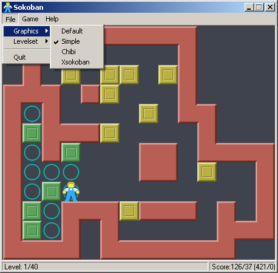

# Sokoban skin Simple Great Badger

A spritesheet designed for Sokoban games.

## Details

- **Author 1:** Borgar Þorsteinsson
- **Author 2:** Carlos Montiers Aguilera
- **Creation Date:** July 20, 2026
- **License:** CC BY-SA 4.0

## Lead

I created this Sokoban skin by adapting the 'Simple' skin created by Borgar Þorsteinsson, as shown in his original freeware program from 2003.

In 2011, the original skin was updated to lighter colors and [released](https://github.com/borgar/sokoban-skins) under Creative Commons Attribution 3.0, a license allowing modifications to the work.

Simple Great Badger skin example:

I made the boxes look less bulky by reducing the edge width.

I reused the original walls but repainted them in a simpler style to reduce their brightness. I also changed their color from red to light gray to reduce visual fatigue.

I added the [Great Badger character](https://github.com/carlos-montiers/sokoban-great-badger), which was designed specifically to work on dark gray backgrounds.

The skin retains the original box and floor colors from the 2003 program, while the box edge colors have been updated.

## License

This work is licensed under the Creative Commons Attribution-ShareAlike 4.0 International License:
https://creativecommons.org/licenses/by-sa/4.0/
